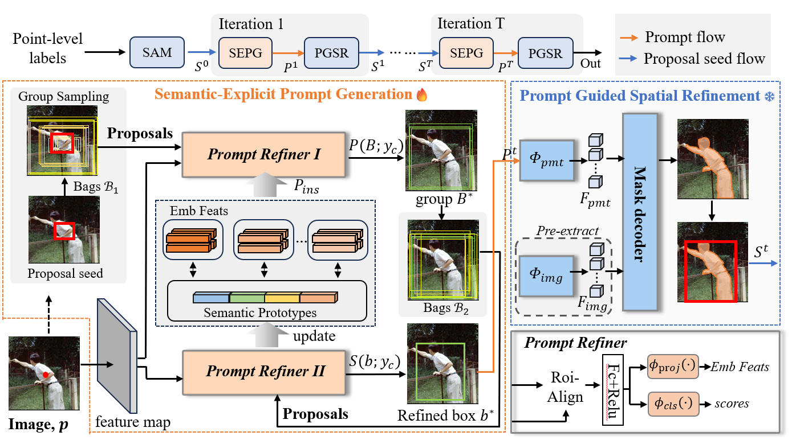

# P2P: Transforming from Point Supervision to Explicit Visual Prompt for Object Detection and Segmentation

### [Paper](https://www.ijcai.org/proceedings/2024/448)

[Guangqian Guo](https://guangqian-guo.github.io), Dian Shao, Chenguang Zhu, Sha Meng, Xuan Wang, [Shan Gao](https://teacher.nwpu.edu.cn/2018010158.html)


> **Abstract**: Point-supervised vision tasks, including detection and segmentation, aiming to learn a network that transforms from points to pseudo labels, have attracted much attention in recent years. However, the lack of precise object size and boundary annotations in the point-supervised condition results in a large performance gap between point- and fully-supervised methods. In this paper, we propose a novel iterative learning framework, Point to Prompt (P2P), for point-supervised object detection and segmentation, with the key insight of transforming from point supervision to explicit visual prompt of the foundation model. The P2P is formulated as an iterative refinement process of two stages: Semantic Explicit Prompt Generation (SEPG) and Prompt Guided Spatial Refinement (PGSR). Specifically, SEPG serves as a prompt generator for generating semantic-explicit prompts from point input via a group-based learning strategy. In the PGSR stage, prompts guide the visual foundation model to further refine the object regions, by leveraging the outstanding generalization ability of the foundation model. The two stages are iterated multiple times to improve the quality of predictions progressively. Experimental results on multiple datasets demonstrate that P2P achieves SOTA performance in both detection and segmentation tasks, further narrowing the performance gap with fully-supervised methods.




## 🔍 Visual Results


## 🥇 Results


## 🥰 Citation

Please cite us if our work is useful for your research.

```bash
@inproceedings{p2p,
title   = {P2P: Transforming from Point Supervision to Explicit Visual Prompt for Object Detection and Segmentation},
author   = {Guo, Guangqian and Shao, Dian and Zhu, Chenguang and Meng, Sha and Wang, Xuan and Gao, Shan},
booktitle = {Proceedings of the Thirty-Third International Joint Conference on Artificial Intelligence,
pages   = {4053--4061},
year    = {2024}}
```

